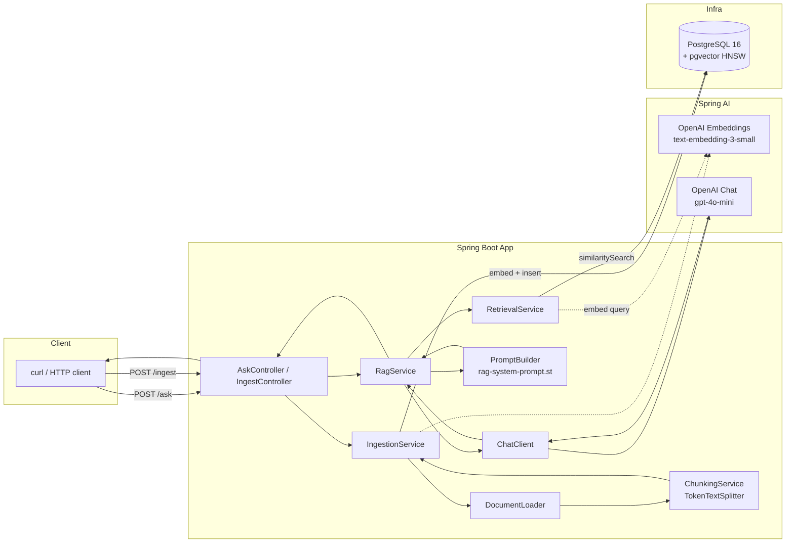

# rag-spring-ai

End-to-end **Retrieval-Augmented Generation (RAG)** reference implementation
built with **Spring Boot 3**, **Spring AI 1.0**, **Java 21**, **PostgreSQL +
pgvector**, and **OpenAI**.

The repository is intentionally small, idiomatic, and production-flavoured:
layered architecture, real vector store (not in-memory), Flyway migrations,
Docker Compose auto-lifecycle in dev, Testcontainers integration test, and
an optional `ollama` profile for fully offline local runs.

---

## What it does

1. **Ingests** a corpus of manufacturing / Industry 4.0 sample documents
   (OEE, MES vs SCADA, predictive maintenance, digital twin / RAMI 4.0,
   MQTT Sparkplug B, OPC UA, SPC, Andon, CMMS, edge computing).
2. **Chunks** each document with a token-aware splitter.
3. **Embeds** chunks via OpenAI `text-embedding-3-small` (1536 dims).
4. **Stores** embeddings in PostgreSQL with the `pgvector` extension, using
   HNSW indexing and cosine distance.
5. On each question, **retrieves** the top-k most relevant chunks,
   builds a context-augmented prompt, and calls `gpt-4o-mini` via the
   Spring AI `ChatClient`.
6. Returns the answer plus per-chunk **citations** (source file, similarity
   score) and request latency.

---

## Architecture



### Module layering

```
api  ─►  rag  ─►  retrieval  ─►  VectorStore
              ╲─►  ingestion  ─►  VectorStore
              ╲─►  PromptBuilder  ─►  ChatClient
```

No cross-layer leak: controllers depend on `RagService` only, the RAG
service orchestrates retrieval + prompting + chat, and infrastructure
beans (`VectorStore`, `ChatClient`, `EmbeddingModel`) are autoconfigured by
Spring AI starters.

---

## Project layout

```
rag-spring-ai/
├── pom.xml
├── compose.yaml                  # pgvector container, auto-lifecycled in dev
├── .env.example                  # API keys + tunables
├── src/main/java/com/apratico/ragspringai/
│   ├── RagSpringAiApplication.java
│   ├── config/                   # RagProperties, ChatClientConfig
│   ├── ingestion/                # Loader, Chunker, IngestionService, BootstrapRunner
│   ├── retrieval/                # RetrievalService
│   ├── rag/                      # RagService, PromptBuilder, Citation
│   └── api/                      # Controllers, DTOs, exception handler
├── src/main/resources/
│   ├── application.yml           # default (OpenAI)
│   ├── application-ollama.yml    # optional offline profile
│   ├── prompts/rag-system-prompt.st
│   ├── db/migration/V1__init_vector_store.sql
│   └── data/samples/*.md         # 10 manufacturing / I4.0 docs
└── src/test/java/...             # unit + WebMvc slice + Testcontainers IT
```

---

## Prerequisites

- **Java 21**
- **Maven 3.9+**
- **Docker** (for the pgvector container; also used by the Testcontainers test)
- An **OpenAI API key** (default profile). Optional: Ollama installed locally
  for the `ollama` profile.

---

## Quick start

### 1. Configure credentials

```bash
cp .env.example .env
# edit .env — set OPENAI_API_KEY
export $(grep -v '^#' .env | xargs)
```

### 2. Build & run

```bash
mvn clean install
mvn spring-boot:run
```

Spring Boot Docker Compose support automatically runs `compose.yaml`, so
the pgvector container comes up before the app. On first start,
`BootstrapIngestionRunner` detects the empty store and ingests the 10
sample documents.

### 3. Ask a question

```bash
curl -s -X POST http://localhost:8080/ask \
  -H 'Content-Type: application/json' \
  -d '{
        "question": "How do I compute OEE and what are the Six Big Losses?",
        "topK": 4
      }' | jq
```

Expected response shape:

```json
{
  "question": "How do I compute OEE and what are the Six Big Losses?",
  "answer": "...",
  "citations": [
    { "source": "oee-kpi-iso22400.md", "score": 0.87 },
    { "source": "mes-vs-scada-isa95.md", "score": 0.64 }
  ],
  "latencyMs": 1234
}
```

### 4. Ingest your own documents

```bash
curl -s -X POST http://localhost:8080/ingest \
  -F "file=@/path/to/your/doc.md" | jq
```

Force a full re-ingestion of the bundled samples:

```bash
curl -s -X POST http://localhost:8080/ingest/samples | jq
```

---

## Configuration

All knobs live in `application.yml` and are overridable via environment
variables (see `.env.example`):

| Property                                     | Env var                    | Default                 |
|----------------------------------------------|----------------------------|-------------------------|
| `spring.ai.openai.api-key`                   | `OPENAI_API_KEY`           | — (required)            |
| `spring.ai.openai.chat.options.model`        | `OPENAI_CHAT_MODEL`        | `gpt-4o-mini`           |
| `spring.ai.openai.embedding.options.model`   | `OPENAI_EMBEDDING_MODEL`   | `text-embedding-3-small` |
| `rag.top-k`                                  | `RAG_TOPK`                 | `4`                     |
| `rag.similarity-threshold`                   | `RAG_SIMILARITY_THRESHOLD` | `0.5`                   |
| `rag.chunk-size`                             | `RAG_CHUNK_SIZE`           | `800` tokens            |
| `rag.bootstrap-enabled`                      | —                          | `true`                  |

### Offline profile: Ollama

```bash
ollama pull llama3.1
ollama pull nomic-embed-text
mvn spring-boot:run -Dspring-boot.run.profiles=ollama
```

The `ollama` profile:
- switches `spring.ai.model.chat` and `spring.ai.model.embedding` to `ollama`;
- uses a separate `vector_store_ollama` table with 768-dim vectors
  (matches `nomic-embed-text`);
- does not require an OpenAI API key.

---

## How the RAG flow works

1. **`AskController`** receives `POST /ask` with `question` and optional `topK`.
2. **`RagService#answer`** orchestrates:
   1. `RetrievalService#retrieve` → `VectorStore#similaritySearch` with
      cosine distance and a similarity threshold.
   2. `PromptBuilder#build` stuffs retrieved chunks into the
      `rag-system-prompt.st` template, instructing the model to cite
      sources by filename and refuse to answer out-of-scope questions.
   3. `ChatClient#prompt(...).call().content()` invokes the configured
      chat model.
3. Citations are materialized from the retrieved chunks' metadata (`source`
   filename + similarity score) and returned alongside the answer.

---

## Tests

```bash
mvn test
```

- `ChunkingServiceTest` — splitter unit.
- `RagServiceTest` — verifies retrieve → prompt → chat orchestration with
  Mockito deep-stubs on `ChatClient`.
- `AskControllerTest` — `@WebMvcTest` slice, covers happy path + validation.
- `ApplicationContextIT` — boots the full context against a `pgvector`
  Testcontainer, runs Flyway migrations, mocks `ChatModel` and
  `EmbeddingModel` so no external API is hit, asserts `/actuator/health`.

---

## Design notes & trade-offs

- **pgvector over Chroma/Qdrant**: a single Postgres is operationally
  simpler for teams that already run relational DBs, supports SQL-side
  joins on metadata, and has first-class Spring AI integration. For
  >100M embeddings, a dedicated vector DB (Qdrant, Milvus, Weaviate) is
  usually the better call.
- **Flyway-owned schema**: `initialize-schema: false` keeps DDL under
  version control instead of letting Spring AI auto-create at boot — a
  non-negotiable for production.
- **HNSW + cosine**: sensible default. Ivfflat is cheaper to build but
  requires training data for recall. L2 / inner-product are supported by
  changing `distance-type`.
- **Bootstrap ingestion**: idempotent by design — probes the store and
  skips if non-empty. Gate-able via `rag.bootstrap-enabled=false`.
- **Prompt template**: kept as an external `.st` resource so prompt
  changes are code-reviewable and don't require a recompile cycle.
- **No RAG reranker / query rewriter**: deliberately out of scope for a
  reference implementation; easy extension points are `RetrievalService`
  and `PromptBuilder`.

---

## Roadmap

- AI Agent with tool use (separate repository).
- Streaming `/ask` endpoint via `ChatClient.stream(...)`.
- Hybrid retrieval (BM25 + vector) with result fusion.
- Per-tenant metadata filters for multi-tenant deployments.

---

## License

MIT — see [LICENSE](LICENSE).
